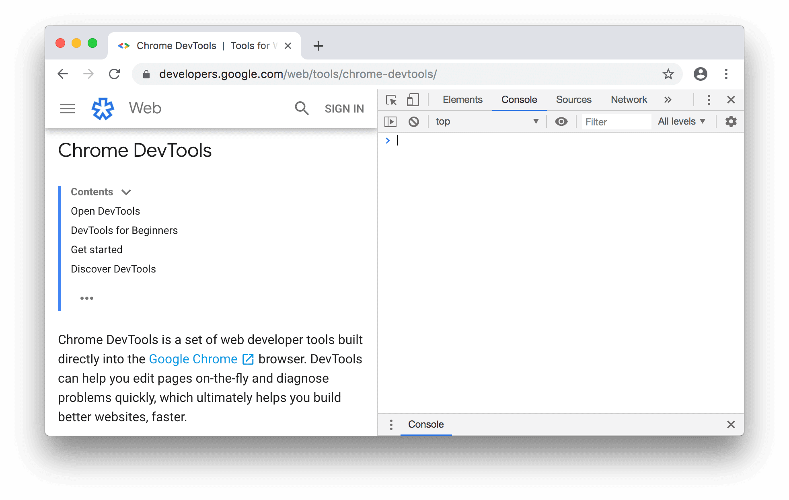

# JavaScript Beginner's Guide


## Introduction

Welcome to this extensive guide built for the aspiring JavaScript beginner. It is an endeavor to put forth a very clear and precise primer on JavaScript. This would be needed by beginners who could be familiar with either HTML5 and CSS or complete beginners in the development of web pages.

## What is JavaScript?
JavaScript is a versatile programming language. This makes it one of the most popular and it greatly helps deliver dynamic applications to the web and interactive web pages. The major application of it is to add client-side functionality to web pages, which can range from simple animations and pop-ups to complex data-driven applications and real-time updates.

## Why Learn JavaScript?
JavaScript is an important skill for any beginner developer. Its advantages include:

- Increased interactivity of the web page
- Dynamic User Experiences
- Real-time Data Updates
- Cross-platform
- Large Community Support and Resources

## Getting Started
This guide will take you through the basics of JavaScript; it goes into the essential areas of variables, data types, functions, loops, and so much more. It also goes over popular frameworks and libraries to develop robust and efficient web applications.

## Prerequisites
Although prior knowledge of HTML5 and CSS is helpful, it's by no means required. Therefore, is this designed to be friendly to the beginner who may have experience in a number of different areas and otherwise. 

## Let's Get Started!
Welcome to the world of JavaScript where you'll learn how to create dynamic, interactive web experiences. I hope this guide will be well on your way to becoming proficient in JavaScript.

## Printing to the Console



This means to display output of one's code on a specific interface called the console. 

### What is the console?
The console is like a message board where your computer can display messages. In the context of JavaScript, the console is where you can see the results of your code. You can access the console on any IDE such as VS Code or simple using your browser by right clicking and selecting *inspect*. Head over to console. This can be done on any web page but for practice always use a new tab or an empty HTML file. 

### What is console.log()?
`console.log()` is a special command in JavaScript that allows developers to send messages to the console. Think of it like sending a note to the message board.

### How do you use console.log()?
To use `console.log()`, you simply type it into your code, followed by the message you want to send to the console. If the message consists of words always embed them in quotes if they are numbers, no need, if arithmetic expressions, no need also but if both words and numbers then we use what is called *String Concatenation*. It will be explained better, much later. 

Some examples:
```
console.log("Hello, World!");

console.log(5);

console.log(1+3);
```

When you run these code snippets, the messages will be:

Hello, World!
5
4

These will appear in the console.

Id you noticed, every line or console.log ended with a semicolon ---> `;`. So everytime you use a `console.log` , end it with a semicolon. 

### Why is console.log() useful?
`console.log()` is useful because it allows you to see what's happening in your code. You can use it to:

- Test whether your code is working correctly
- Display messages to the user
- Debug your code (find and fix errors)
_________

### Giveaway Exercises

1. Print your name to the console
2. Display the sum of your age and your favorite number
3. To the console result the difference between this year and your year of birth
4. Display to the console the title of your favorite movie
5. Print the quotient of 15 and 3 to the console  

## Numbers and Math in JavaScript

Let's focus on numbers now and later we talk about letters, words and statements. JavaScript provides various ways to work with numbers and perform mathematical operations. Let's head on to knowing the types of numbers in JavaScript. 

### Number Types
JavaScript has two main number types. Don't get confused, it's the same as in Mathematics. We have *whole numbers* and *fractions* or specifically let's stick to *decimals* or *decimal numbers*. That said:

1. *Integers*: Whole numbers, either positive, negative, or zero (e.g., `1`, `-5`, `0`).
2. *Floating-Point Numbers*: Decimal numbers (e.g., `3.14`, `-0.5`).

### Mathematical Operations
JavaScript supports basic arithmetic operations:

*Addition (+)*
```
console.log(5 + 3);  // sum = 8
```

*Subtraction (-)*
```
console.log(10 - 4);  // difference = 6
```

*Multiplication* (*)
```
console.log(7 * 2) ;  // product = 14
```

*Division (/)*
```
console.log(9 / 3) ;  // quotient = 3
```

*Modulus (%)*
```
console.log(17 % 5);  // remainder = 2
```

*Exponentiation* (**)
```
console.log(2 ** 3);  // result = 8
```

Modulus: display ls remainder

Exponent: displays the result of the first number with an index of the second

### Order of Operations
JavaScript follows the standard order of operations (PEMDAS):

1. *P*arentheses: Evaluate expressions inside parentheses first.
2. *E*xponents: Evaluate any exponential expressions next.
3. *M*ultiplication and *D*ivision: Evaluate multiplication and division operations from left to right.
4. *A*ddition and *S*ubtraction: Finally, evaluate any addition and subtraction operations from left to right.

Example
```
console.log(2 + 3 * 4 ** 2 - 10 / 2);
```

To evaluate this expression, follow the order of operations:

1. Exponents: `4 ** 2 = 16`
2. Multiplication: `3 * 16 = 48`
3. Addition: `2 + 48 = 50`
4. Division: `10 / 2 = 5`
5. Subtraction: `50 - 5 = 45`

Therefore, `result` equals `45`.

How cool is that?!


